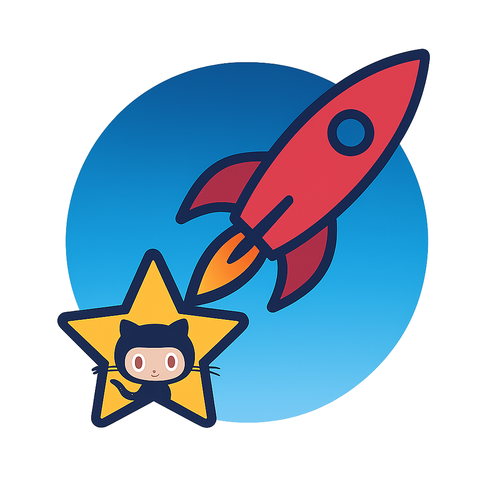

<h1 align="center">AI Frameworks & Toolkits</h1>

<i>Libraries, platforms, or SDKs for building, training, evaluating models.</i>

<a href="../README.md">← Back to main page</a>

 <strong><a href="https://github.com/langchain-ai/langchain">langchain-ai/langchain</a> 🔥🔥🔥</strong> 
<em>🦜🔗 Build context-aware reasoning applications</em> 

  

 <strong><a href="https://github.com/langgenius/dify">langgenius/dify</a> 🔥🔥🔥</strong> 
<em>Production-ready platform for agentic workflow development.</em> 

  

 <strong><a href="https://github.com/fastapi/fastapi">fastapi/fastapi</a> 🔥🔥🔥</strong> 
<em>FastAPI framework, high performance, easy to learn, fast to code, ready for production</em> 

  

 <strong><a href="https://github.com/3b1b/manim">3b1b/manim</a> 🔥🔥🔥</strong> 
<em>Animation engine for explanatory math videos</em> 

  

 <strong><a href="https://github.com/OpenInterpreter/open-interpreter">OpenInterpreter/open-interpreter</a> 🔥🔥🔥</strong> 
<em>A natural language interface for computers</em> 

  

 <strong><a href="https://github.com/GokuMohandas/Made-With-ML">GokuMohandas/Made-With-ML</a> 🔥🔥🔥</strong> 
<em>Learn how to design, develop, deploy and iterate on production-grade ML applications.</em> 

  

 <strong><a href="https://github.com/deepspeedai/DeepSpeed">deepspeedai/DeepSpeed</a> 🔥🔥🔥</strong> 
<em>DeepSpeed is a deep learning optimization library that makes distributed training and inference easy, efficient, and effective.</em> 

  

 <strong><a href="https://github.com/mindsdb/mindsdb">mindsdb/mindsdb</a> 🔥🔥🔥</strong> 
<em>AI's query engine - Platform for building AI that can answer questions over large scale federated data. - The only MCP Server you'll ever need</em> 

  

 <strong><a href="https://github.com/lutzroeder/netron">lutzroeder/netron</a> 🔥🔥🔥</strong> 
<em>Visualizer for neural network, deep learning and machine learning models</em> 

  

 <strong><a href="https://github.com/stanfordnlp/dspy">stanfordnlp/dspy</a> 🔥🔥🔥</strong> 
<em>DSPy: The framework for programming—not prompting—language models</em> 

  

 <strong><a href="https://github.com/microsoft/semantic-kernel">microsoft/semantic-kernel</a> 🔥🔥🔥</strong> 
<em>Integrate cutting-edge LLM technology quickly and easily into your apps</em> 

  

 <strong><a href="https://github.com/pydantic/pydantic">pydantic/pydantic</a> 🔥🔥🔥</strong> 
<em>Data validation using Python type hints</em> 

  

 <strong><a href="https://github.com/doccano/doccano">doccano/doccano</a> 🔥🔥🔥</strong> 
<em>Open source annotation tool for machine learning practitioners.</em> 

  

 <strong><a href="https://github.com/ml-explore/mlx-examples">ml-explore/mlx-examples</a> 🔥🔥</strong> 
<em>Examples in the MLX framework</em> 

  

 <strong><a href="https://github.com/NVIDIA/cuda-python">NVIDIA/cuda-python</a> 🔥</strong> 
<em>CUDA Python: Performance meets Productivity</em> 

  

 <strong><a href="https://github.com/abhishekkrthakur/tez">abhishekkrthakur/tez</a> 🔥</strong> 
<em>Tez is a super-simple and lightweight Trainer for PyTorch. It also comes with many utils that you can use to tackle over 90% of deep learning projects in PyTorch.</em> 

  

 <strong><a href="https://github.com/SeungyounShin/Llama2-Code-Interpreter">SeungyounShin/Llama2-Code-Interpreter</a> </strong> 
<em>Make Llama2 use Code Execution, Debug, Save Code, Reuse it, Access to Internet</em> 

  

 <strong><a href="https://github.com/finic-ai/doctran">finic-ai/doctran</a> </strong> 
<em></em> 

  

 <strong><a href="https://github.com/jabertuhin/image-classification-api">jabertuhin/image-classification-api</a> </strong> 
<em>Serving model through api. FastApi + PytorchLightning</em> 

  

 <strong><a href="https://github.com/ml-jku/EVA">ml-jku/EVA</a> </strong> 
<em>One Initialization to Rule them All: Fine-tuning via Explained Variance Adaptation</em> 

  

 <strong><a href="https://github.com/ai-hpc/ai-hardware-engineer-path">ai-hpc/ai-hardware-engineer-path</a> </strong> 
<em> a self-study guide for AI hardware engineers, covering a wide range of topics from foundational knowledge to advanced FPGA and acceleration techniques, Nvidia Jetson and edge AI, and more.</em> 

  

