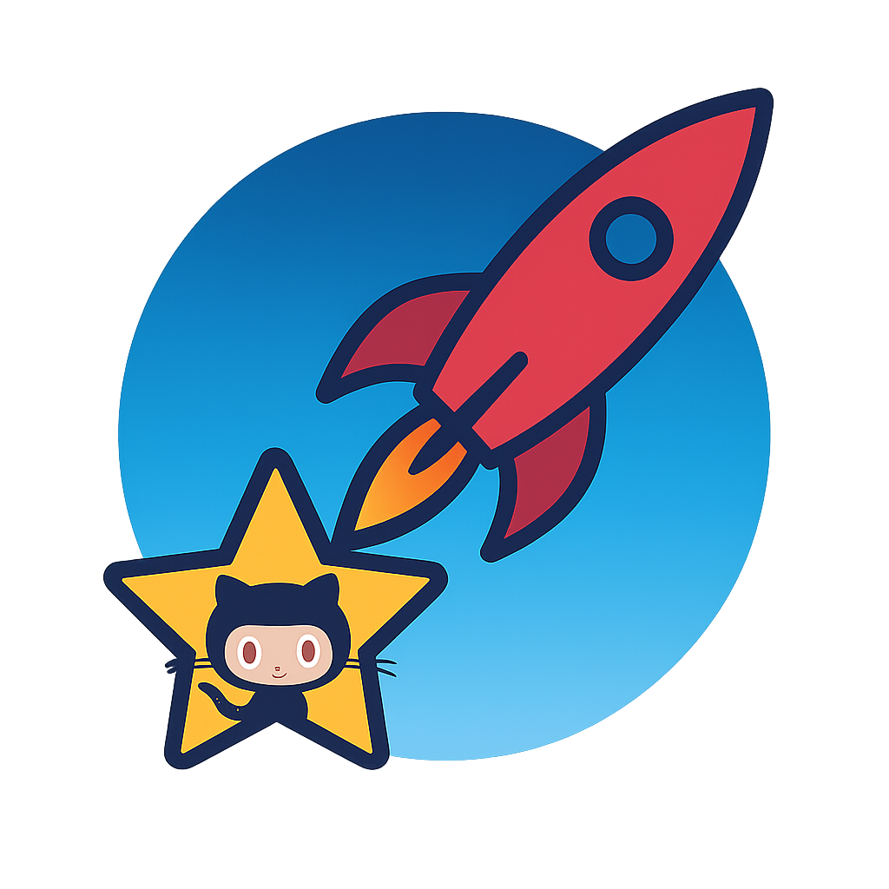

<h1 align="center">Others</h1>

<i>If none of the above fit.</i>

<a href="../README.md">↠Back to main page</a>

 <strong><a href="https://github.com/kamranahmedse/developer-roadmap">kamranahmedse/developer-roadmap</a> 🔥🔥🔥</strong> 
<em>Interactive roadmaps, guides and other educational content to help developers grow in their careers.</em> 

  

 <strong><a href="https://github.com/TheAlgorithms/Python">TheAlgorithms/Python</a> 🔥🔥🔥</strong> 
<em>All Algorithms implemented in Python</em> 

  

 <strong><a href="https://github.com/microsoft/vscode">microsoft/vscode</a> 🔥🔥🔥</strong> 
<em>Visual Studio Code</em> 

  

 <strong><a href="https://github.com/bregman-arie/devops-exercises">bregman-arie/devops-exercises</a> 🔥🔥🔥</strong> 
<em>Linux, Jenkins, AWS, SRE, Prometheus, Docker, Python, Ansible, Git, Kubernetes, Terraform, OpenStack, SQL, NoSQL, Azure, GCP, DNS, Elastic, Network, Virtualization. DevOps Interview Questions</em> 

  

 <strong><a href="https://github.com/immich-app/immich">immich-app/immich</a> 🔥🔥🔥</strong> 
<em>High performance self-hosted photo and video management solution.</em> 

  

 <strong><a href="https://github.com/hakimel/reveal.js">hakimel/reveal.js</a> 🔥🔥🔥</strong> 
<em>The HTML Presentation Framework</em> 

  

 <strong><a href="https://github.com/xtekky/gpt4free">xtekky/gpt4free</a> 🔥🔥🔥</strong> 
<em>The official gpt4free repository | various collection of powerful language models | o4, o3 and deepseek r1, gpt-4.1, gemini 2.5</em> 

  

 <strong><a href="https://github.com/AppFlowy-IO/AppFlowy">AppFlowy-IO/AppFlowy</a> 🔥🔥🔥</strong> 
<em>Bring projects, wikis, and teams together with AI. AppFlowy is the AI collaborative workspace where you achieve more without losing control of your data. The leading open source Notion alternative.</em> 

  

 <strong><a href="https://github.com/twitter/the-algorithm">twitter/the-algorithm</a> 🔥🔥🔥</strong> 
<em>Source code for Twitter's Recommendation Algorithm</em> 

  

 <strong><a href="https://github.com/Stirling-Tools/Stirling-PDF">Stirling-Tools/Stirling-PDF</a> 🔥🔥🔥</strong> 
<em>#1 Locally hosted web application that allows you to perform various operations on PDF files</em> 

  

 <strong><a href="https://github.com/juliangarnier/anime">juliangarnier/anime</a> 🔥🔥🔥</strong> 
<em>JavaScript animation engine</em> 

  

 <strong><a href="https://github.com/odoo/odoo">odoo/odoo</a> 🔥🔥🔥</strong> 
<em>Odoo. Open Source Apps To Grow Your Business.</em> 

  

 <strong><a href="https://github.com/slidevjs/slidev">slidevjs/slidev</a> 🔥🔥🔥</strong> 
<em>Presentation Slides for Developers</em> 

  

 <strong><a href="https://github.com/siyuan-note/siyuan">siyuan-note/siyuan</a> 🔥🔥🔥</strong> 
<em>A privacy-first, self-hosted, fully open source personal knowledge management software, written in typescript and golang.</em> 

  

 <strong><a href="https://github.com/HeyPuter/puter">HeyPuter/puter</a> 🔥🔥🔥</strong> 
<em>🌠The Internet OS! Free, Open-Source, and Self-Hostable.</em> 

  

 <strong><a href="https://github.com/twentyhq/twenty">twentyhq/twenty</a> 🔥🔥🔥</strong> 
<em>Building a modern alternative to Salesforce, powered by the community.</em> 

  

 <strong><a href="https://github.com/geekcomputers/Python">geekcomputers/Python</a> 🔥🔥🔥</strong> 
<em>My Python Examples</em> 

  

 <strong><a href="https://github.com/ManimCommunity/manim">ManimCommunity/manim</a> 🔥🔥🔥</strong> 
<em>A community-maintained Python framework for creating mathematical animations. </em> 

  

 <strong><a href="https://github.com/kuchin/awesome-cto">kuchin/awesome-cto</a> 🔥🔥🔥</strong> 
<em>A curated and opinionated list of resources for Chief Technology Officers, with the emphasis on startups</em> 

  

 <strong><a href="https://github.com/nextcloud/server">nextcloud/server</a> 🔥🔥🔥</strong> 
<em>☁️ Nextcloud server, a safe home for all your data</em> 

  

 <strong><a href="https://github.com/nicolargo/glances">nicolargo/glances</a> 🔥🔥🔥</strong> 
<em>Glances an Eye on your system. A top/htop alternative for GNU/Linux, BSD, Mac OS and Windows operating systems.</em> 

  

 <strong><a href="https://github.com/RSSNext/Folo">RSSNext/Folo</a> 🔥🔥🔥</strong> 
<em>🧡 Follow everything in one place</em> 

  

 <strong><a href="https://github.com/th-ch/youtube-music">th-ch/youtube-music</a> 🔥🔥🔥</strong> 
<em>YouTube Music Desktop App bundled with custom plugins</em> 

  

 <strong><a href="https://github.com/Byaidu/PDFMathTranslate">Byaidu/PDFMathTranslate</a> 🔥🔥🔥</strong> 
<em>PDF scientific paper translation with preserved formats - 基于 AI 完整保留排版的 PDF 文档全文双语翻译，支持 Google/DeepL/Ollama/OpenAI 等服务，提供 CLI/GUI/MCP/Docker/Zotero</em> 

  

 <strong><a href="https://github.com/Mozilla-Ocho/llamafile">Mozilla-Ocho/llamafile</a> 🔥🔥🔥</strong> 
<em>Distribute and run LLMs with a single file.</em> 

  

 <strong><a href="https://github.com/karakeep-app/karakeep">karakeep-app/karakeep</a> 🔥🔥🔥</strong> 
<em>A self-hostable bookmark-everything app (links, notes and images) with AI-based automatic tagging and full text search</em> 

  

 <strong><a href="https://github.com/dair-ai/ml-visuals">dair-ai/ml-visuals</a> 🔥🔥🔥</strong> 
<em>🨠ML Visuals contains figures and templates which you can reuse and customize to improve your scientific writing.</em> 

  

 <strong><a href="https://github.com/mikf/gallery-dl">mikf/gallery-dl</a> 🔥🔥🔥</strong> 
<em>Command-line program to download image galleries and collections from several image hosting sites</em> 

  

 <strong><a href="https://github.com/google-deepmind/deepmind-research">google-deepmind/deepmind-research</a> 🔥🔥🔥</strong> 
<em>This repository contains implementations and illustrative code to accompany DeepMind publications</em> 

  

 <strong><a href="https://github.com/patchy631/ai-engineering-hub">patchy631/ai-engineering-hub</a> 🔥🔥🔥</strong> 
<em>In-depth tutorials on LLMs, RAGs and real-world AI agent applications.</em> 

  

 <strong><a href="https://github.com/wasp-lang/open-saas">wasp-lang/open-saas</a> 🔥🔥🔥</strong> 
<em>A free, open-source SaaS app starter for React & Node.js with superpowers. Full-featured. Community-driven.</em> 

  

 <strong><a href="https://github.com/opf/openproject">opf/openproject</a> 🔥🔥🔥</strong> 
<em>OpenProject is the leading open source project management software.</em> 

  

 <strong><a href="https://github.com/markmap/markmap">markmap/markmap</a> 🔥🔥🔥</strong> 
<em>Build mindmaps with plain text</em> 

  

 <strong><a href="https://github.com/3b1b/videos">3b1b/videos</a> 🔥🔥</strong> 
<em>Code for the manim-generated scenes used in 3blue1brown videos</em> 

  

 <strong><a href="https://github.com/midday-ai/midday">midday-ai/midday</a> 🔥🔥</strong> 
<em>Invoicing, Time tracking, File reconciliation, Storage, Financial Overview & your own Assistant made for Freelancers</em> 

  

 <strong><a href="https://github.com/aaPanel/BillionMail">aaPanel/BillionMail</a> 🔥🔥</strong> 
<em>BillionMail gives you open-source MailServer, NewsLetter,  Email Marketing — fully self-hosted, dev-friendly, and free from monthly fees. Join the discord: https://discord.gg/asfXzBUhZr</em> 

  

 <strong><a href="https://github.com/AnswerDotAI/fasthtml">AnswerDotAI/fasthtml</a> 🔥🔥</strong> 
<em>The fastest way to create an HTML app</em> 

  

 <strong><a href="https://github.com/antiwork/gumroad">antiwork/gumroad</a> 🔥🔥</strong> 
<em>Sell stuff and see what sticks</em> 

  

 <strong><a href="https://github.com/vercel/next-forge">vercel/next-forge</a> 🔥🔥</strong> 
<em>Production-grade Turborepo template for Next.js apps.</em> 

  

 <strong><a href="https://github.com/Azure/azure-sdk-for-python">Azure/azure-sdk-for-python</a> 🔥</strong> 
<em>This repository is for active development of the Azure SDK for Python. For consumers of the SDK we recommend visiting our public developer docs at https://learn.microsoft.com/python/azure/ or our versioned developer docs at https://azure.github.io/azure-sdk-for-python. </em> 

  

 <strong><a href="https://github.com/ai-dynamo/dynamo">ai-dynamo/dynamo</a> 🔥</strong> 
<em>A Datacenter Scale Distributed Inference Serving Framework</em> 

  

 <strong><a href="https://github.com/liam-hq/liam">liam-hq/liam</a> 🔥</strong> 
<em>Automatically generates beautiful and easy-to-read ER diagrams from your database.</em> 

  

 <strong><a href="https://github.com/Netflix/vizceral">Netflix/vizceral</a> 🔥</strong> 
<em>WebGL visualization for displaying animated traffic graphs</em> 

  

 <strong><a href="https://github.com/u14app/deep-research">u14app/deep-research</a> 🔥</strong> 
<em>Use any LLMs (Large Language Models) for Deep Research. Support SSE API and MCP server.</em> 

  

 <strong><a href="https://github.com/midday-ai/v1">midday-ai/v1</a> 🔥</strong> 
<em>An open-source starter kit based on Midday.</em> 

  

 <strong><a href="https://github.com/JohannesKaufmann/html-to-markdown">JohannesKaufmann/html-to-markdown</a> 🔥</strong> 
<em>⚙️ Convert HTML to Markdown. Even works with entire websites and can be extended through rules.</em> 

  

 <strong><a href="https://github.com/ericciarla/trendFinder">ericciarla/trendFinder</a> 🔥</strong> 
<em>Stay on top of trending topics on social media and the web with AI</em> 

  

 <strong><a href="https://github.com/markqvist/Reticulum">markqvist/Reticulum</a> 🔥</strong> 
<em>The cryptography-based networking stack for building unstoppable networks with LoRa, Packet Radio, WiFi and everything in between.</em> 

  

 <strong><a href="https://github.com/fastrepl/hyprnote">fastrepl/hyprnote</a> 🔥</strong> 
<em>Secure AI-powered meeting notetaker that runs on your device and keeps your data private.</em> 

  

 <strong><a href="https://github.com/StartBootstrap/startbootstrap-freelancer">StartBootstrap/startbootstrap-freelancer</a> 🔥</strong> 
<em>A flat design, one page, MIT licensed Bootstrap portfolio theme created by Start Bootstrap</em> 

  

 <strong><a href="https://github.com/cactus-compute/cactus">cactus-compute/cactus</a> 🔥</strong> 
<em>Cross-platform framework for deploying LLM/VLM/TTS models locally on smartphones.</em> 

  

 <strong><a href="https://github.com/open-webui/pipelines">open-webui/pipelines</a> 🔥</strong> 
<em>Pipelines: Versatile, UI-Agnostic OpenAI-Compatible Plugin Framework </em> 

  

 <strong><a href="https://github.com/janarosmonaliev/github-globe">janarosmonaliev/github-globe</a> 🔥</strong> 
<em>The Globe from Github's homepage implemented in ThreeJS with beautiful shading.</em> 

  

 <strong><a href="https://github.com/gensyn-ai/rl-swarm">gensyn-ai/rl-swarm</a> 🔥</strong> 
<em>A fully open source framework for creating RL training swarms over the internet.</em> 

  

 <strong><a href="https://github.com/yousinix/portfolYOU">yousinix/portfolYOU</a> 🔥</strong> 
<em>A beautiful portfolio Jekyll theme that works with GitHub Pages.</em> 

  

 <strong><a href="https://github.com/AatmikJain/ComputerScienceBooks">AatmikJain/ComputerScienceBooks</a> 🔥</strong> 
<em>Some Useful books for Computer Science</em> 

  

 <strong><a href="https://github.com/jarrekk/Jalpc">jarrekk/Jalpc</a> 🔥</strong> 
<em>🍎Jalpc -- A flexible Jekyll theme, 3 steps to build your website. </em> 

  

 <strong><a href="https://github.com/AnswerDotAI/fasthtml-example">AnswerDotAI/fasthtml-example</a> </strong> 
<em>Example fasthtml applications demonstrating a range of web programming techniques</em> 

  

 <strong><a href="https://github.com/tbaltrushaitis/cv">tbaltrushaitis/cv</a> </strong> 
<em>:mortar_board: Best in Class modern CV, Resume and Portfolio website template. All-in-One-Page site with simply customizable builder.</em> 

  

 <strong><a href="https://github.com/nolly-studio/cult-directory-template">nolly-studio/cult-directory-template</a> </strong> 
<em>A full stack Next.js, Shadcn, and Supabase directory template. Build your startup directory effortlessly with features like user authentication, product filters, and customizable themes. Advanced admin perks and AI magic.</em> 

  

 <strong><a href="https://github.com/0xairdropfarmer/medium-clone-on-node">0xairdropfarmer/medium-clone-on-node</a> </strong> 
<em>clone Medium on Nodejs and Reactjs</em> 

  

 <strong><a href="https://github.com/chrisbobbe/jekyll-theme-prologue">chrisbobbe/jekyll-theme-prologue</a> </strong> 
<em>A Jekyll version of the "Prologue" theme by HTML5 UP</em> 

  

 <strong><a href="https://github.com/Maharshi-Pandya/cudacodes">Maharshi-Pandya/cudacodes</a> </strong> 
<em>Learnings and programs related to CUDA</em> 

  

 <strong><a href="https://github.com/rkinas/triton-resources">rkinas/triton-resources</a> </strong> 
<em>A curated list of resources for learning and exploring Triton, OpenAI's programming language for writing efficient GPU code.</em> 

  

 <strong><a href="https://github.com/bloominstituteoftechnology/portfolio-website">bloominstituteoftechnology/portfolio-website</a> </strong> 
<em>A project to get you up and running with a portfolio site</em> 

  

 <strong><a href="https://github.com/Codehagen/propdock">Codehagen/propdock</a> </strong> 
<em>En omfattende plattform for finansiell analyse, verdivurdering og leiekontrakter for næringseiendom</em> 

  

 <strong><a href="https://github.com/ComposioHQ/grok-cli">ComposioHQ/grok-cli</a> </strong> 
<em></em> 

  

 <strong><a href="https://github.com/IvanReznikov/DataVerse">IvanReznikov/DataVerse</a> </strong> 
<em>Public code of Dr. Ivan Reznikov used in posts, articles, conferences</em> 

  

 <strong><a href="https://github.com/arunpshankar/LLM-Text-to-SQL-Architectures">arunpshankar/LLM-Text-to-SQL-Architectures</a> </strong> 
<em>A collection of architectural patterns leveraging Large Language Models (LLMs) for efficient Text-to-SQL generation.</em> 

  

 <strong><a href="https://github.com/temporalio/samples-python">temporalio/samples-python</a> </strong> 
<em>Samples for working with the Temporal Python SDK</em> 

  

 <strong><a href="https://github.com/FAIRplus/the-fair-cookbook">FAIRplus/the-fair-cookbook</a> </strong> 
<em>The FAIR cookbook, containing recipes to make your data more FAIR. Find the rendered version on:</em> 

  

 <strong><a href="https://github.com/john-smilga/gatsby-strapi-portfolio-site-2020">john-smilga/gatsby-strapi-portfolio-site-2020</a> </strong> 
<em></em> 

  

 <strong><a href="https://github.com/wenet-e2e/llm-papers">wenet-e2e/llm-papers</a> </strong> 
<em>List of Large Lanugage Model Papers</em> 

  

 <strong><a href="https://github.com/thiagodp/concordialang">thiagodp/concordialang</a> </strong> 
<em>✅ Generate functional tests automatically from your Agile specification</em> 

  

 <strong><a href="https://github.com/usri/Comprehensive-Document-Translator">usri/Comprehensive-Document-Translator</a> </strong> 
<em></em> 

  

 <strong><a href="https://github.com/oleg-agapov/oleg-agapov.github.io">oleg-agapov/oleg-agapov.github.io</a> </strong> 
<em>Oleg Agapov's CV website</em> 

  

